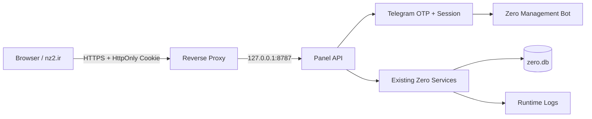

# پنل مدیریت Zero

پنل وب فارسی و RTL با تم Glass/Cinematic Space است. UI هیچ business logic ندارد و فقط از adapter داخلی `zero/panel_api.py` استفاده می‌کند. منطق Listener، Router، Memory و Agentها دست‌نخورده مانده‌اند.

## معماری



## ساختار

```text
panel/
  index.html       # shell, login, navigation
  styles.css       # RTL glass UI, responsive layout
  app.js           # API client and rendering only
zero/panel_api.py  # auth, CSRF, dashboard adapter, security headers
scripts/run_panel.py # starts API beside existing management bot
```

## ورود و امنیت

- Telegram-only OTP؛ کد ۶ رقمی، عمر ۲ دقیقه، حداکثر ۵ تلاش.
- کد و Session خام در حافظه پردازش نگهداری نمی‌شود؛ فقط Hash کد/Session در state داخلی نگهداری می‌شود.
- Cookie: `HttpOnly`, `Secure`, `SameSite=Strict`.
- CSRF token برای endpointهای تغییر وضعیت.
- فقط Owner فعلی و ناظران تعریف‌شده در `panel_viewer_usernames` اجازه درخواست OTP دارند؛ ناظران فقط read-only هستند و تمام endpointهای تغییر وضعیت برایشان مسدود است.
- یوزرنیم فقط وقتی با `owner_username` یا فهرست ناظران منطبق باشد پذیرفته می‌شود.
- پس از هر ورود موفق Viewer، یک هشدار شامل username ادمین، IP معتبر و زمان UTC به Owner (`owner_user_id`) در تلگرام ارسال می‌شود؛ شکست موقت ارسال، ورود را متوقف نمی‌کند و در audit ثبت می‌شود.
- هدرهای ضد Clickjacking/MIME sniffing و CSP فعال‌اند.
- Secretها در UI نمایش داده نمی‌شوند.

> در production حتماً HTTPS termination انجام شود؛ چون Cookie امن روی HTTP مرورگر ارسال نمی‌شود.

## اجرا

```bash
export ZERO_PANEL_HOST=127.0.0.1
export ZERO_PANEL_PORT=8787
/root/zero/.venv/bin/python /root/zero/scripts/run_panel.py
```

سرویس systemd موجود، `run_panel.py` را اجرا می‌کند. برای دامنه:

```nginx
server {
  server_name panel.nz2.ir;
  location / { proxy_pass http://127.0.0.1:8787; proxy_set_header Host $host; proxy_set_header X-Forwarded-Proto https; }
}
```

## Environment Variables

| Variable | Default | توضیح |
|---|---:|---|
| `ZERO_PANEL_HOST` | `127.0.0.1` | آدرس bind داخلی |
| `ZERO_PANEL_PORT` | `8787` | پورت API و static UI |
| `ZERO_CONFIG_PATH` | `/etc/zero/zero.yaml` | مسیر config عمومی production (`0640 root:zero`) |
| `ZERO_PANEL_PUBLIC_BASE_URL` | `https://panel.nz2.ir` | آدرس عمومی برای reverse proxy؛ Frontend همچنان از مسیرهای نسبی استفاده می‌کند |
| `ZERO_SECRET_FILE` | `runtime/secrets/zero.secrets.yaml` | مسیر secret محافظت‌شده موجود |

### نمونه Caddy (فقط نمونه؛ deploy نشده)

```caddy
panel.nz2.ir {
  reverse_proxy 127.0.0.1:8787 {
    header_up X-Forwarded-Proto {scheme}
    header_up Host {host}
    flush_interval -1
  }
}
```

SSE روی مسیرهای نسبی `/api/realtime` و `/api/logs/stream` است و با buffering خاموش reverse proxy سازگار است.

## Production checklist

- [ ] DNS `panel.nz2.ir` و TLS معتبر
- [ ] Reverse proxy فقط به loopback وصل باشد
- [ ] `Secure` Cookie در HTTPS تست شود
- [ ] دسترسی Owner Telegram بررسی شود
- [ ] rate-limit لایه proxy و firewall فعال باشد
- [ ] log rotation برای `panel.log` و audit فعال باشد
- [ ] backup رمزنگاری‌شده DB قبل از فعال‌سازی mutation endpoints
- [ ] smoke test ورود OTP، logout و logout-all
- [ ] CSP و هدرهای امنیتی با مرورگر واقعی بررسی شوند
- [ ] قبل از عمومی‌کردن، endpointهای mutation بخش‌های Memory/Jobs/Settings با APIهای واقعی Zero تکمیل و تست شوند

## وضعیت دامنه پیاده‌سازی

Dashboard، login shell، navigation، responsive RTL، API health/dashboard و session flow پیاده‌سازی شده‌اند. صفحات تخصصی منو فعلاً read-only shell هستند و عمداً عملیات جعلی یا placeholder داده‌ای ندارند؛ mutation و realtime تخصصی فقط بعد از قرارداد API همان بخش‌ها باید اضافه شوند.
